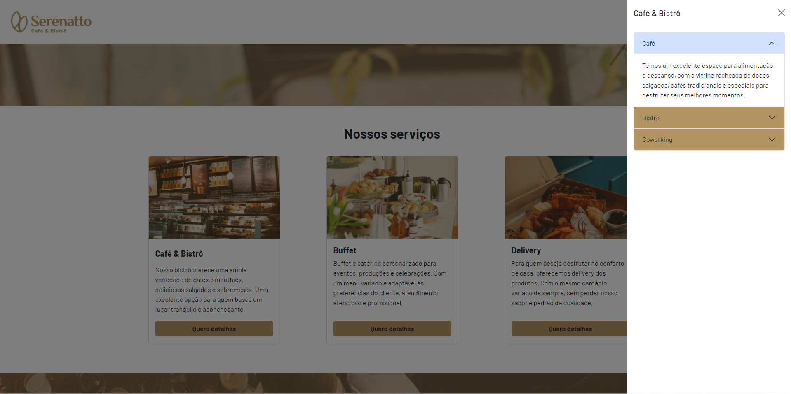

## Visão Geral

### O projeto

- Projeto de um site de café

### Screenshot

### Links

- Live Site URL: [Serenatto](https://serenatto-one-beta.vercel.app/)

## Meu processo

### Criado com

- HTML
- CSS
- Bootstrap5
- JavaScript

### O que eu aprendi

- Aprendi mais sobre Bootstrap5
- Aprendi a fazer modo Dark com JS

## Autor

- GitHub - [João Metzdorf](https://github.com/joaometzdorf)
